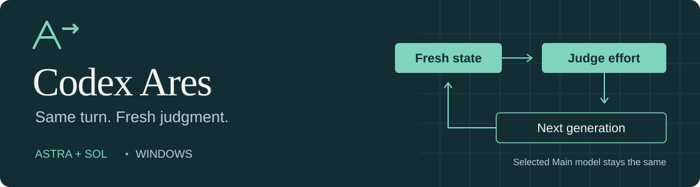

# Windows용 Codex Ares

<p align="center">
  
</p>

**모델은 고르세요. 추론 강도는 Ares가 조절합니다.**

파일을 확인할 때와 복잡한 구현을 판단할 때 필요한 추론 강도는 다릅니다. Ares는 매 생성 단계 직전에 현재 상황을 다시 보고, 선택한 모델이 다음 응답에 사용할 추론 강도를 조절합니다. 작업은 같은 대화에서 계속됩니다.

<p align="center">
  <a href="README.md">English</a> · <a href="README.ko.md">한국어</a> · <a href="README.ja.md">日本語</a> · <a href="README.zh-CN.md">简体中文</a>
</p>

<p align="center">
  <a href="https://github.com/M-T-D-N/codex-ares-windows/actions/workflows/test.yml"></a>
  <a href="docs/build.md"></a>
  <a href="docs/compatibility.md"></a>
  <a href="LICENSE"></a>
</p>

<p align="center">
  <a href="#시작하기">시작하기</a> · <a href="#내-모델에-맞는-경로-고르기">경로 선택</a> · <a href="docs/architecture.md">작동 방식</a> · <a href="docs/pilot-results.md">시험 결과</a>
</p>

> [!NOTE]
> **소스 공개판:** 고정된 의존성으로 로컬에서 빌드합니다. 시작 전에 [빌드 안내](docs/build.md), [호환 범위](docs/compatibility.md), [개발 검증](docs/validation.md)을 확인하세요.

개발 안내: 이 다운스트림은 AI가 생성하고 사용자가 시험했습니다. [전체
고지](#ai-개발-고지)를 확인하세요.

## Codex에 더해지는 기능

- **작업 도중에도 추론 강도를 자동 조절합니다.** 첫 생성부터 다음 단계를 평가해 `medium`, `high`, `xhigh`, `max`를 선택할 수 있습니다. 설정을 바꾸느라 단계마다 작업을 멈추지 않아도 됩니다.
- **선택한 모델이 계속 작업합니다.** Astra는 Astra로, Sol은 Sol로, Sol 6.1은 Sol 6.1로 유지됩니다. 강도 변경은 같은 턴의 다음 생성에 적용되고, 기존 워커는 각자의 역할을 이어갑니다.
- **평가가 늦어져도 작업을 이어갑니다.** 평가 시간이 초과되거나 평가기에 연결할 수 없으면 메인 모델은 기준 강도로 계속 진행하고 제어기는 회복을 처리합니다.

일반 Astra·Sol·Sol 6.1·Luna도 그대로 선택할 수 있습니다. 자동 제어는 Ares 경로를 골랐을 때 시작됩니다.

## 내 모델에 맞는 경로 고르기

| Codex에서 선택 | 작업하는 모델 | 강도를 판단하는 모델 |
|---|---|---|
| **Astra Ares** | GPT-6 Astra | 독립 GPT-6 Luna / High |
| **Sol Ares** | GPT-6 Sol | 독립 GPT-6 Luna / High |
| **Sol 6.1-Ares** | GPT-6.1 Sol | 독립 GPT-6 Luna / High |

**Luna가 평가하고, 메인 모델이 작업합니다.** Luna 경로는 기존 Codex 로그인을 사용합니다. 별도 평가자가 도구·MCP 없이 현재 판단에 필요한 문맥을 읽고 추론 강도를 권고합니다.


## 시작하기

**Windows x64**, Node.js 22+/npm, Git, rustup, Visual Studio x64 C++ 빌드 도구와 호환되는 Codex Desktop 설치본이 필요합니다. 현재 native 소스는 **Codex 0.160.0**을 기준으로 합니다. 기존 로컬 Ares 실행본의 실제 Desktop 기동과 Luna 판단→메인 응답을 확인했습니다. [호환 범위](docs/compatibility.md)에서 검증 범위를 확인하세요.

```powershell
git clone https://github.com/M-T-D-N/codex-ares-windows.git
Set-Location codex-ares-windows
npm run setup
```

설치 명령은 고정된 소스와 의존성을 받고 native patch를 적용한 뒤 Ares를 PC에서 빌드합니다. V8 다운로드를 검증하고, 재사용할 빌드 캐시는 프로젝트에 보관합니다. 설치된 Codex와 인증정보, 기본 Rust toolchain은 유지합니다.

빌드가 끝나면 진행 중인 로컬 작업을 마치고 앱 메뉴에서 Codex를 정상 종료하세요. 일반 권한 PowerShell에서 Ares를 시작합니다.

```powershell
.\scripts\start.ps1
```

모델 선택에서 **Astra Ares**, **Sol Ares** 또는 **Sol 6.1-Ares**를 고르면 Luna 평가를 사용합니다.

| 하고 싶은 일 | 방법 |
|---|---|
| 실행 중인 backend와 제어 상태 확인 | `.\scripts\status.ps1` 실행 |
| 고정 강도로 돌아가기 | 턴이 끝난 뒤 일반 모델 선택 |
| 현재 작업 멈추기 | Codex의 기본 Stop 사용 |
| 설치본으로 돌아가기 | 앱을 정상 종료한 뒤 평소처럼 Codex 실행 |

[자세한 빌드 안내와 실패 후 재개 방법](docs/build.md)

## 실제 Codex 작업에서 확인했습니다

기존 시험에서는 네 경로, 같은 턴 안의 강도 변경, 여러 대화의 동시 진행, 평가 지연 이후 회복을 확인했습니다. [공개한 시험 결과](docs/pilot-results.md)에서 업무 12조건의 전체 비교와 Jev 판단 51건 분석을 볼 수 있습니다.

<details>
<summary><strong>시험 결과와 현재 추천</strong></summary>

- **Astra:** 평가 대기시간을 받아들일 수 있으면 Luna 판단 경로를 선택할 수 있습니다. 지연이 중요하면 일반 Astra/xhigh가 간단합니다.
- **Sol:** 측정한 업무에서는 일반 Sol/High를 기본으로 권합니다.
- **과거 Jev 시험:** 판단 51건이 모두 메인으로 이관됐습니다. Jev 경로는 제거했으며 당시 측정은 파일럿 보고서에 보존합니다.

이 소규모 비교는 제어 동작을 확인한 근거이며, 보편적인 비용 절감이나 품질 우위를 입증한 결과는 아닙니다. 실패·미관측과 자연 승격·강제 제어시험의 차이도 결과에 포함했습니다.

</details>

현재 배포 형태는 **PC에서 빌드하는 소스**입니다. 최근 수정은 실행기가 끝난 뒤에도 평가 연결을 유지하고, 현재 요구사항을 보존하며 긴 평가 입력을 줄이고, 개발 빌드의 중단된 도구 기록을 복구합니다. 실제 Sol 6.1-Ares 턴에서 Luna/High의 Medium 권고가 적용되어 응답을 마쳤습니다. [개발 검증](docs/validation.md)은 이 로컬 실행 근거와 공개용 경로 검사를 구분하며 지연·실패도 기록합니다.

## 더 알아보기

[작동 구조](docs/architecture.md) · [빌드와 의존성](docs/build.md) · [호환 범위](docs/compatibility.md) · [개인정보 안내](docs/privacy.md) · [시험 결과](docs/pilot-results.md)

README는 영어·한국어·일본어·중국어 간체로 제공합니다. 상세 기술 문서는 현재 영어입니다.

## AI 개발 고지

다운스트림 변경 대부분은 사용자가 제공한 요구사항과 반복적인 수용 요청에 따라
OpenAI Codex가 작성·수정했습니다. 저장소 소유자는 소스 코드를 직접 읽거나
검토하지 않았습니다. 검증은 소유자의 Windows/Codex 환경에서 수행한 자동화
테스트와 실제 기능 시험을 근거로 합니다. 독립적인 제3자 코드 검토나 보안 감사는
수행되지 않았습니다.

**요약:** AI가 생성하고 사용자가 시험했으며, 수동 코드 리뷰를 거치지 않았습니다.

## Upstream 표기와 라이선스

[Astra-Ares](https://github.com/miuuyy/Astra-Ares)의 파생 어댑터이며 [OpenAI Codex](https://github.com/openai/codex)를 수정합니다. 정확한 원본 정보는 [lock](patches/codex/upstream.lock.json)에 있습니다. OpenAI 공식 제품이나 upstream의 지원 약속이 아닙니다.

[라이선스](LICENSE)는 bridge·신규 어댑터의 MIT와 native 변경의 Apache-2.0을 유지합니다. [제3자 고지](THIRD_PARTY_NOTICES.md)에 원본 조건을 보존했습니다. 설치 Desktop과 실행파일 의존성은 이 소스 묶음으로 재배포하지 않습니다.
